---
output:
  xaringan::moon_reader:
    includes:
    self_contained: false
    lib_dir: libs
    nature:
      highlightStyle: github
      highlightLines: true
      countIncrementalSlides: false
editor_options: 
  chunk_output_type: console
---
class: center, middle, inverse
background-image: url("Figures/Background_intro.png")
background-size: cover
background-color: #2c5c34

```{css echo=FALSE}
.pull-left {
  float: left;
  width: 44%;
}
.pull-right {
  float: right;
  width: 44%;
}
.pull-right ~ p {
  clear: both;
}
```

# PhD Defence

## Natural Experiments in Geography and Institutions:
## Essays in the Economic History of Denmark

### Christian Vedel,<br> University of Southern Denmark

### 2023-09-25

---

# Outline and motivation
.pull-left[
**Motivation**
- Why is wealth concentrated in some geographic regions? 
- We all want to understand how to create a better tomorrow in the broadest sense

- Four contributions: Two about geography; Two about institutions 
- Based on natural experiments 
  
- History: The story of a society shaped by geography and fights over religious institutions 

]

.pull-right[
**The chapters**

```{r echo=FALSE, out.width="75%", fig.align='left'}

```
]

---


# Overblik og motivation (Dansk)
.pull-left[
**Motivation**
- Hvorfor er velstand koncentret i bestemte geografiske områder? 
- Vi ønsker alle at skabe en bedre morgendag i bredeste forstand

- Fire bidrag: To om geography; To om institutioner 
- Baseret på naturlige eksperimenter
  
- Historie: Historien om et samfund formet af geografi og religiøse institutioner

]

.pull-right[
**Kapitlerne**

```{r echo=FALSE, out.width="75%", fig.align='left'}

```
]


???
- Tak fordi I er her. Jeg snakker Engelsk om lidt igen, men her er et overblik på Dansk, som måske kan hjælpe jer lidt I at navigere.
- Tak fordi I er her. 

---
class: center, middle, inverse
background-image: url("Figures/Background_ch1.png")
background-size: cover
background-color: #273a8f

# Chapter 1:
# A perfect storm and the natural endowments of trade-enabling infrastructure


---


# Introduction
.pull-left[
- Geography is more than soil quality. We are slaves of geomorphology.  
- In 1825 the Agger isthmus* broke by 1834 a natural channel had formed 
- 700 years prior a similar channel had silted up
- Is infrastructure important in economic development? (Fogel, 1964)

#### What will be demonstrated:
  - The channel caused trade 
  - The channel caused a local population boom
  - Mechanism
  - Evidence for the reverse natural experiment in 1100s

]

.pull-right[
```{r echo=FALSE, out.width="100%", fig.align='center'}
knitr::include_graphics("Figures/1714 Homann - Tabula Generalis lutiae ... www.kb.dk.jpg")
```
*Humann (1750) 'Tabula Generalis Iutia' www.kb.dk*

```{r echo=FALSE, out.width="100%", fig.align='center'}

```
*Petersen (1877)*

]


???
**3/45**  
- Understanding what causes wealth (wellbeing, etc.) is at the heart of Economics 
- Understanding the interplay between geography (environment) and Economics is vital in the 21st century


---


???
- This map essentially shows the entire story I am going to tell you today 

---
# Map
.center[
<iframe src="https://www.google.com/maps/embed?pb=!1m14!1m12!1m3!1d704129.7470425251!2d8.826970647896832!3d56.880787313536544!2m3!1f0!2f0!3f0!3m2!1i1024!2i768!4f13.1!5e1!3m2!1sda!2sdk!4v1634159326111!5m2!1sda!2sdk" width="600" height="450" style="border:0;" allowfullscreen="" loading="lazy"></iframe>
]

---
# Litterature
.pull-left[
- History desribed by Poulsen (2019, 2022)
- Does infrastructure promote regional development? (Fogel, 1964; Bogart, 2009; Donaldson & Hornbeck, 2016; Berger & Enflo, 2017; etc.)
- Does trade cause growth? (Frankel & Romer, 1999; Feyrer, 2021; Pascali, 2017)
- Fundamental determinants of economic wealth: *Institutions or geography?* 
- Pragmatically: Infrastructure is expensive

**Why this case**: 
- Neat natural experiment: No-one decided that a canal should be constructed
]


.pull-right[

*'Two fishermen by a boat', Anker (1889), smk.dk*  
]

???
**15/45**

---
name: timeline
# Timeline

--

#### Pre-event: 
- 1085-1208: Natural western channel closed because of gradual land rises (since the last ice age)
- 1672: Eastern Limfjord town Aalborg 2nd largest in DK 
- Other Limfjord towns lacked far behind under Aalborg's local hedgemony

--

#### Event:
- 1825: Breach of Agger Isthmus
- 1834: Ships start consistently passing through a new natural channel 
- 1841: Independent trade rights to west Limfjord market towns 
- 1850-1900: [Secondary infrastructure and growth](#post-event) 
- 1860-1900: Strong(er) growth


---
# Empirical strategy

$$log(y_{it}) = Affected_i \times Year_t \beta_t + FE + \varepsilon_{it}$$

*Affected is:*
- The **West** Limfjord, or
- Improved **market access** after the breach

---


---
# Market Access
.pull-left[
Based on cost distance from parishes to harbours: 
$${MA}_p = \sum_{h \in H} [CostDist(p, h) + 1]^\theta \times W_{p}$$
- CostDist - Dijkstra's agorithm and 1/10 land/sea ratio 
- $\theta = -1$  
- Breach caused new harbours in West Limfjord: $H\rightarrow H^*$

$$MA_{before} = MA_p|H \\
MA_{after} = MA_p|H^*$$
Main measure:
$$\Delta log(MA) = log(MA_{after})-log(MA_{before})$$
]

.pull-right[

]

---
name: str-presentation
# 1. Trade: Sound Toll Register (STR)

.pull-left[
- Most ships to and from the Baltic region (1.8 mio. passages, 1497-1857) 
- Extract traffic for Denmark  
- Digitized by team at Gronningen (Veluwenkamp & Woude, 2009)
- Only ships passing [Elsinore](#elsinor)
 

*Kronborg at Elsinore anno 1500, wikimedia commons*
]

.pull-right[

*Page from Sound Toll Register in 1734 (www.rug.nl)*
]

---
name: censusdata

# 2. Population: Census data

.pull-left[
- Link Lives 
- Individual-level data for the years 1787, 1801, 1834, 1845, 1860, 1870, 1890 and 1901 
- From this: Parish level population counts + occupations 
- New procedure to automatically make [HISCO labels](#hisco)


]

.pull-right[
*Census, wikimedia commons*


]

---
# The channel caused trade


*Descriptive statistics from Svalgaard (1977) sourced from customs archives*
---
# The channel caused trade

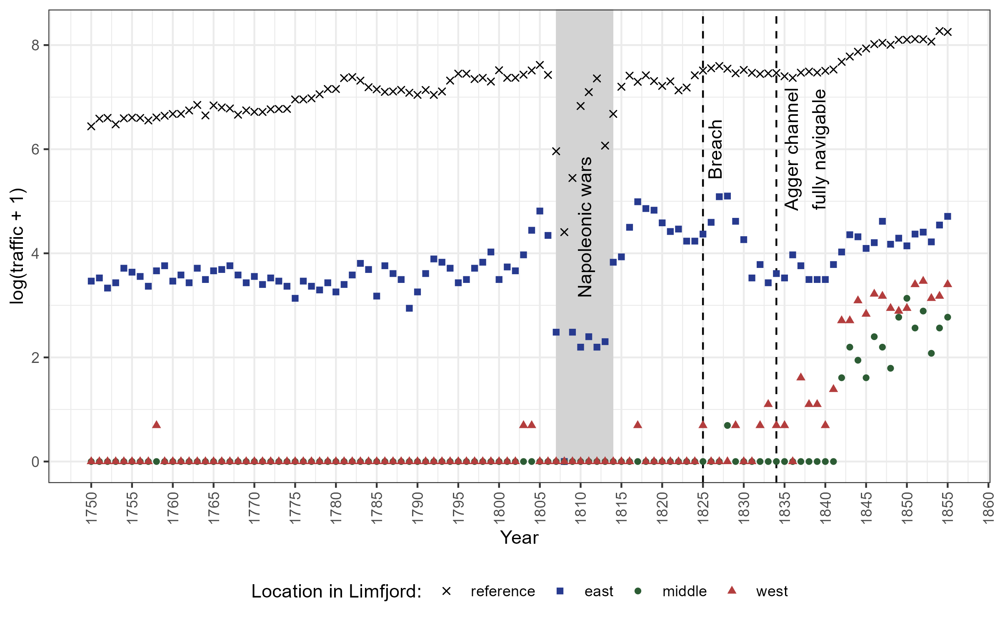
---
name: str-results
# The channel caused trade
.pull-left[
- **Data**: Panel of Danish ports 1750-1855 
- **Outcome**: Cargo ship traffic with origin or destination in a specified port
- PPML estimator following Silva & Tenreyro (2006) 
- In the order of 400% growth in trade in the region
- Local descriptive trade stats show the same story:
  + From 6 to 62 ships in Thisted harbour (1834-1876)
  + 997% increase in oats export, Thisted (1801-1853) 
]


.pull-right[
```{r echo=FALSE, out.width="100%", fig.align='center'}

```
*Larger on next page*
]

---
# The channel caused trade
```{r echo=FALSE, out.width="100%", fig.align='center'}

```

---
name: pop
# Population increase

.pull-left[
### Market Access approach
```{r echo=FALSE, out.width="100%", fig.align='center'}
knitr::include_graphics("Figures/pop_ma.png")
```

**Robustness to:**
- [Comparison groups](#Rob_comp)
- [Parameter choices](#all-paramMA)
]
--
.pull-right[
### Dummy approach
```{r echo=FALSE, out.width="100%", fig.align='center'}
knitr::include_graphics("Figures/pop_dummy.png")
```

**Robustness to:**
- [Comparison groups](#Rob_comp)
- [Pre-treatment characteristics](#pre_treat_adj)

]

???
- Rauch & Maurer (2022): 2.3 for panama canal

---
name: mechanism1
.pull-left[
# Mechanism
- **First-order mechanism:** Trade (as documented)
- **Remaining questions**: 

  + *Why was the take-off relatively slow?* 
  + **Answer:** [Institutions and secondary infrastructure](#instmech) had to adapt

  + *What carried the population growth?* 
  + **Likely answer:** Fertility driven by rise of manufacturing and fishing
]

.pull-right[

*Loading Butter in a Danish port (1924)*

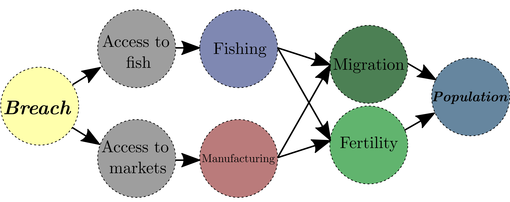
*DAG of the suggested mechanism* 
]


---
.pull-left[
**Fishing:**
```{r echo=FALSE, out.width="100%", fig.align='center'}

```

]
--
.pull-right[
**Manufacturing:**
```{r echo=FALSE, out.width="100%", fig.align='center'}

```

]

---
### But can this explain the population growth?

**Labor force as share of total pop:**
```{r echo=FALSE, out.width="70%", fig.align='center'}
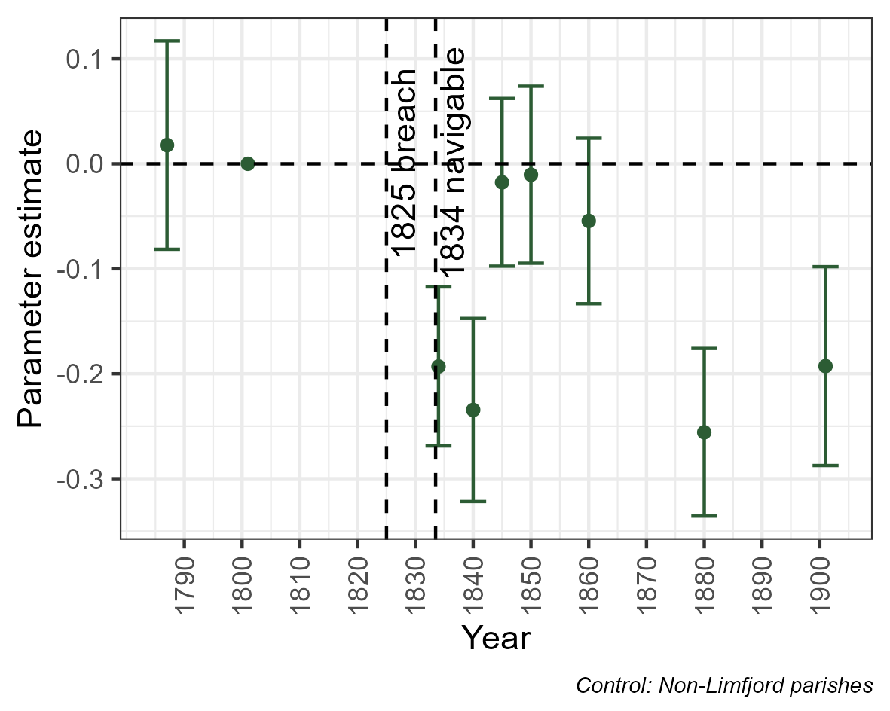
```

---
### Migration and fertility
.pull-left[
**People who live in different county than their birth county:**
```{r echo=FALSE, out.width="100%", fig.align='center'}

```
]
--
.pull-right[
**Child/women ratio (ch. 1-5 years per f. 15-45):**
```{r echo=FALSE, out.width="100%", fig.align='center'}
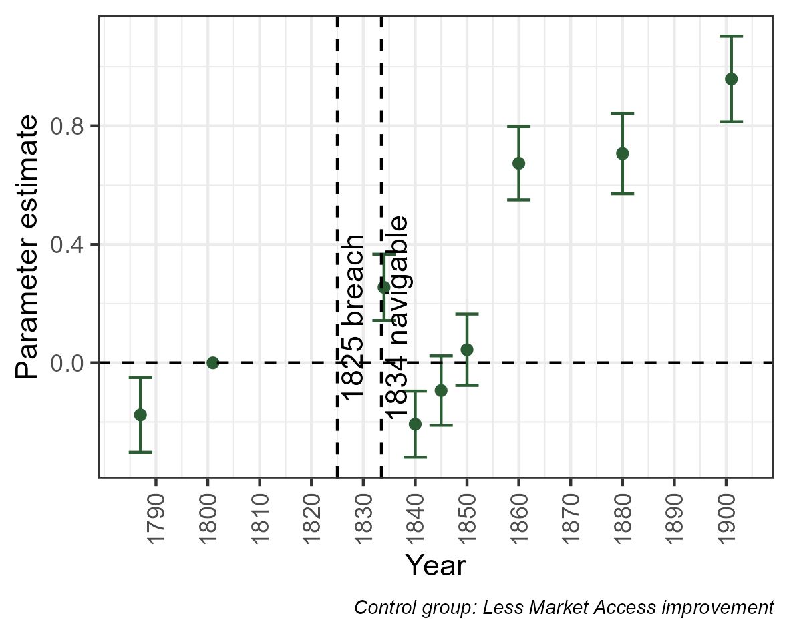
```

]


---
# The reverse natural experiment

.pull-left[ 
- The Limfjord also had a western opening in the Viking age. 
- Ideal hub for viking fleets heading west towards England (Matthiessen 1941; Rasmussen, 1966) 
- Northwestern Denmark in 1100s is very different from ditto in 1800s
- Between 1086 and 1208 the channel silted up (Saxo (1208) + geological sources)

**Data?** 
- Just use register data! 
- Turning dating range + coordinate into panel of economic activity
]

.pull-right[

*'Overseas Guests', Roerich (1901)*
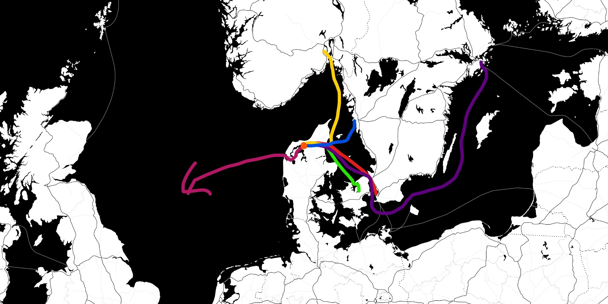
*maps.stamen.com*
]

---
# Descriptive evidence

---
name: arch1
**Plot of effect to the likelihood of a coin finding being generated**
```{r echo=FALSE, out.width="80%", fig.align='center'}

```

[More details](#appendixarch); [Matched sample alternative](#matching_coins)

---
name: arch2
**Plot of effect to the likelihood of a building finding being generated**
```{r echo=FALSE, out.width="80%", fig.align='center'}

```
[More details](#appendixarch); [Matched sample alternative](#matching_buildings)

---
name: other-results
# Conclusion 
.pull-left[
- **RQ:** How are we affected by geography? Does infrastructure cause development?
- Storm led to a channel and improved connectivity in 1834
- The population grew 24 percent in a generation in affected parishes 
- Population growth carried by trade and adaptation
- Intrinsic growth (fertility), fishing and manufacturing
]

.pull-right[
```{r echo=FALSE, out.width="60%", fig.align='center'}

```
*Oven from Morsø Iron foundry. Founded in a Limfjord Market town with British coal and Swedish iron in 1853*
]

---
# Overview

.pull-right[
**The chapters**

```{r echo=FALSE, out.width="75%", fig.align='left'}

```
]

---
# Overview

.pull-left[
- **Chapter 1:** Geo-morpohology mattered for the location of prosperity in 1834 and in the 1100s 
]

.pull-right[
**The chapters**

```{r echo=FALSE, out.width="75%", fig.align='left'}

```
]

---
class: center, middle, inverse
background-image: url("Figures/Background_ch2.png")
background-size: cover
background-color: #b33d3d

# Chapter 2:
# Holy Cows and Spilt Milk:
## A Firm Level Analysis of the Impact of Religiousity on Productivity

### Coauthored with Jeanet Bentzen, Nina Boberg-Fazlic, Paul Sharp, Christian Volmar Skovsgaard

---
# Introduction

.pull-left[
- O’Rourke (2006, 2007) compares Denmark and Ireland
  + “Denmark’s homogeneity, not its Protestantism, led to the success of cooperation there”
- But did conflict and religiosity play any role for Danish development?
- Period when Denmark industrialized was one of religious conflict within the Lutheran church, rise of “Inner Mission” (IM)
- **Finding:** Religious conflict drove lower productivity
]

.pull-right[

Carl Moe, kb.dk
]


---
# Historical background 
.pull-left[
- Denmark converts to Christianity in 965 and adopts Lutheranism in 1536 
- In 1849 Denmark gets its first 'democratic' constitution 
- Question of governance of the church unsolved (still is) 
- Cooperative creameries and two revivalist reglious movements springs from this: Inner Mission and Grundtvigianism 
- Crucial issue: Should creameries produce on Sundays? 
]

.pull-right[

]

---
# Imagine that chimney on a Sunday


---
# Data and identification
.pull-left[
**Data:**
- Newly digitized data on Mission houses, when and where they were build 
- Operational Statistics of Creameries (Sharp et al, 2023) enriched with location 
- Haue (1978) provides list on Sunday closed creameries 
  + 11685 observations on 964 creameries
  + Milk, Butter, influence of IM and various controls
- Problem of translating mission house location to local IM influence in creameries 
  + $IM_x=\sum_{h} (dist(h,x)+1)^{-1}$
]

.pull-right[
**Empirical strategy:** 
- Milk butter ratio: How much milk does it take to produce a unit of butter?

$$MB_{it}= IM_{it}\beta_1+\mathbf{z}_{it}\gamma+FE+\varepsilon_{it}$$
$$ln(Butter_{it})= ln(Milk_{it})\beta_1+IM_{it}\beta_2+...$$

**Bartik style instruments:**
- Early IM would cause later IM (it is in the name) 
1. Carl Moe was semi-randomly appointed to Harboører and Skanderup 
2. IM in 1890, before our data 

]

???
What about a bad harvest?

---
# IM influence in 1890
```{r echo=FALSE, out.width="100%", fig.align='center'}

```
---
# IM influence in 1920
```{r echo=FALSE, out.width="100%", fig.align='center'}
knitr::include_graphics("Figures/Missionhouses.png")
```


---
# Results OLS
**Regression results**
```{r echo=FALSE, out.width="60%", fig.align='left'}
knitr::include_graphics("Figures/OLS_WP1.png")
```


**Interpretaiton**
- Robust negative association between IM and productivity 
- Large and meaningful effect size

---
# Results IV
```{r echo=FALSE, out.width="60%", fig.align='left'}

```


**Interpretaiton**
- Robust negative association between IM and productivity 
- Large and meaningful effect size 
- Neither instrument can be rejected

---
# Mechanisms
.pull-left[

1. We can test whether it is carried by Sabbatical production itself 
2. We can test whether there are 'smoking guns' of conflict 

]

.pull-right[
**Results**
- We *cannot* find that Sabbatical production had a negative impact on productivity 
- We *can* demonstrate indicators of conflict were associated with IM
]

---
# Was Sabbatical production the mechanism behind negative effect of IM? 
```{r echo=FALSE, out.width="75%", fig.align='center'}
knitr::include_graphics("Figures/Mechanism1_WP1.png")
```

---
# Could conflict feasibly be the mechanism? 
```{r echo=FALSE, out.width="75%", fig.align='center'}
knitr::include_graphics("Figures/Mechanism2_WP1.png")
```

---
# Conclusion 
.pull-left[
- Non violent religious conflict can have large negative effects on the economy (~25,000 2010 USD) 
- Denmark industrialized in religious conflict 
- Effect carried by conflict rather than religious production practices 
- In a polarizing world, it is worth remembering that conflicts (even non-violent once) drags on valuable resources 
- The conflict was carried with Danish migrants to the US
]

.pull-right[

Carl Moe, kb.dk
]


---
# Overview

.pull-left[
- **Chapter 1:** Geo-morpohology mattered for the location of prosperity in 1834 and in the 1100s 
]

.pull-right[
**The chapters**

```{r echo=FALSE, out.width="75%", fig.align='left'}

```
]

---
# Overview

.pull-left[
- **Chapter 1:** Geo-morpohology mattered for the location of prosperity in 1834 and in the 1100s 
- **Chapter 2:** Religious conflict drove production loss in the dairy sector
]

.pull-right[
**The chapters**

```{r echo=FALSE, out.width="75%", fig.align='left'}

```
]

---
class: center, middle, inverse
background-image: url("Figures/Background_ch3.png")
background-size: cover
background-color: #DE7500

# Chapter 3:
# Does Cultural Assimilation Matter?

### Coauthored with Jeanet Bentzen, Nina Boberg-Fazlic, Paul Sharp, Christian Volmar Skovsgaard

---
# Introduction
.pull-left[
- IM / Grundtvig conflict would be ignited among Danish american migrants by the arrival of Grundtvig's son 
- One would promote integration, the other would promote Danish identity 
- Ideal case to test assimilation while keeping culture constant 
]

.pull-right[

*Frederik Lange Grundtvig with family, www.danmarkshistorien.dk*
]

---
.pull-left[
### Sad Danes
(Holy Danes)

- Emphasis on assimilation 
- Focus on America
- Strict religious view
]

.pull-right[
### Happy Danes

- Danish language and traditon (folkliness) 
- Connection between belief and nationality
]

---
# Historical background 
.pull-left[
- Comparatively few Danes migrated and mostly from 1868 until 1900 
- Danish Americans did not identify with IM/Gr conflict 
- Danes attended Dano/Norwegian churches 
- Arrival of Grundtvigianism caused trouble 
- Especially with the arrival of Grundtvig's son (1883)
- The conflict was institutionalised (Danish Association and Danish People Society) 
- Seperate Danish language publications: 'Dannevirke' and 'Danskeren'
]

.pull-right[
*Grundtvigian Dannevirke, 1880*

]

---
# Empricial strategy 
.pull-left[
1. Test whether the cultural split caused dissimilar rates of integration 
2. Test whether this affected occupational outcomes (does assimilaiton matter)

**1. Differential assimilation**
- Danish versus American names
  + Explored in a TWFE design 
  + Explored with a DiD using Grundtvig's son 
- Anglicization of Danish newspapers 
  + AI language detection of probability of English 

]

.pull-right[

  
**2. Occupational outcomes** 
- Occupations converted to standardized categories using Dahl & Vedel (2023) 
- Used to test occupational ranking, nonmanual and farm labour tendencies 

**Data:**
- IPUMS
- Museum of Danish America's archives: Churches + Newspapers
]

???
Jens or Jack, Brittany or Birthe 

---
# Balance
```{r echo=FALSE, out.width="80%", fig.align='center'}

```

---
# Different naming practices after conflict
```{r echo=FALSE, out.width="80%", fig.align='center'}

```

---
# Anglicization of Holy newspapers
.pull-left[
- Each faction sponsored a newspaper 
- We can measure how English the content is with a language detecter 
  +  $[Text]\Rightarrow P(En)$
- Example sentence: "He is a farmer. He grows wheat" 
  + "Han er bonde. Han dyrker hvede."
  + "Han er *farmer*. Han dyrker hvede." 
  + "Han er *farmer*. Han dyrker *wheat*" 
- We kan measure Englishness in every single publication using the entire text
- We did this with each page of 1254 editions of *Dannevirke* and *Danskeren* 
]

.pull-right[
*Grundtvigian Dannevirke, 1880*

]

---

# Anglicization of Holy newspapers
```{r echo=FALSE, out.width="100%", fig.align='center'}

```

---
# Did this language difference cause differential occupational outcomes? 
```{r echo=FALSE, out.width="50%", fig.align='center'}

```

---
# Conclusion
- Wide interest in questions of culture, migration and the labour market 
- Typically based on comparison between nationalities 
- Grundtvigian split caused differential integration 
- No difference in occupational status

---
# Overview

.pull-left[
- **Chapter 1:** Geo-morpohology mattered for the location of prosperity in 1834 and in the 1100s 
- **Chapter 2:** Religious conflict drove production loss in the dairy sector
]

.pull-right[
**The chapters**

```{r echo=FALSE, out.width="75%", fig.align='left'}

```
]

---
# Overview

.pull-left[
- **Chapter 1:** Geo-morpohology mattered for the location of prosperity in 1834 and in the 1100s 
- **Chapter 2:** Religious conflict drove production loss in the dairy sector 
- **Chapter 3:** Despite differential approaches to assimilation, labour market outcomes were similar  
]

.pull-right[
**The chapters**

```{r echo=FALSE, out.width="75%", fig.align='left'}

```
]


---
class: center, middle, inverse
background-image: url("Figures/Background_ch4.png")
background-size: cover
background-color: #2c5c34

# Chapter 4:
# Adaptability, Diversification, and Energy Shocks:
## A Firm Level Productivity Analysis
### Coauthored with Sofia Teives Henriques, Paul Sharp, Xanthi Tsoukli

---
# Overview
.pull-left[
### Context
- Energy in early industrialisation 
- Supply and stability of supply are both important 
- Adaptability is the alternative

### Chapter
- WW1 + Spanish flu strained coal supplies 
- Butter factories with access to alternative fuel (peat) could adapt  
- Productivity advantage accrued 
]

.pull-right[

*Stouby Cooperative Creamery,* 
*(Elbrecht, 1915-18, vol II, p. 46)*
]


???
**3/45**  

---
# Litterature 

.pull-left[
### Economic history 
- Available coal supplies were important for industrialisation (Allen, 2009; Fernihough and O'Rourke, 2010; and many more) 
]

.pull-right[
### Economics of energy 
- Adaptability matters (Walter et al 2004; Blum and Legey, 2012; and many more)
]

### Our contribution 
- Microlevel exogenous identification when coal suddenly is missing: 
  + Alternative fuel sources were advantageous 
- Relevant historical case in a world of strained supply chains 
  
---
# Coal, butter and cooperatives 

.pull-left[
- Denmark spent centuries looking for coal without luck (Ranestad & Sharp, 2021) 
- Bristish Coal, responsible for Danish butter in the UK (Henriques & Sharp, 2016)  
]

.pull-right[
.center[
Modern Danish Butter sold at Tescos in the UK  

*Source: Openfoodfacts.org*

]
]


---
# Supply shock to British Coal 

.pull-left[
- War and influenza (in various ways)
- Limited coal production and shipping from the UK
- Coal supplies limited from 1914 and forward lasting into the early 1920s
]

.pull-right[
.center[
Coal Imports and Prices in Denmark, 1900-1928

*Source: Norman (1959)*
]
]

---
class: center
### Coal Imports and Prices in Denmark, 1900-1928
  
*Source: Norman (1959)*


---
# Butter production 

.pull-left[
- Cooperate farmers milk their cows and deliver it to the creamery 
- (Industrial, coal-powered) technology is used to extract butter 
- Sufficient scale is important  
- Milk/butter ratio (MB ratio) measures the ability to extract butter from milk. 
  + Lower means more efficient 
  + Lower is more productive
  + Lower is better 
]

.pull-right[

]

---
# Peat availability 
```{r echo=FALSE, out.width="80%", fig.align='center'}

```

---
# Empirical strategy
*RQ:*
- Can the adverse effects of Coal shortage be mitigated by available alternatives? 

.pull-left[

]

--
.pull-right[
**Strategy:**
- Influence of peat availability every year $\mathbf{\beta_t}$

$$MB_{it}= Peat_{it}\mathbf{\beta_t}+\mathbf{z'}_{it}\gamma+FE+\varepsilon_{it}$$
- Alternatives should only matter after shortage
]

---
# Peat mitigated negative productivity shocks
```{r echo=FALSE, out.width="80%", fig.align='center'}

```

*Approx 10,786 2010-USD lost for every creamery*

---
# Mechanisms: Survival, investments and efficiency (1/2)

---
# Mechanisms: Survival, investments and efficiency (2/2)


---
# Conclusion
- Alternatives are important 
- Alternatives are also important beyond their immediate necessity 

---
# Overview

.pull-left[
- **Chapter 1:** Geo-morpohology mattered for the location of prosperity in 1834 and in the 1100s 
- **Chapter 2:** Religious conflict drove production loss in the dairy sector 
- **Chapter 3:** Despite differential approaches to assimilation, labour market outcomes were similar  
]

.pull-right[
**The chapters**

```{r echo=FALSE, out.width="75%", fig.align='left'}

```
]

---
# Overview

.pull-left[
- **Chapter 1:** Geo-morpohology mattered for the location of prosperity in 1834 and in the 1100s 
- **Chapter 2:** Religious conflict drove production loss in the dairy sector 
- **Chapter 3:** Despite differential approaches to assimilation, labour market outcomes were similar  
- **Chapter 4:** Diverse access to energy was (is) important
]

.pull-right[
**The chapters**

```{r echo=FALSE, out.width="75%", fig.align='left'}

```
]

---
# Conclusion: Why are some places wealthy?

.pull-left[
- If we knew... 

- *What is the role of geography?*
  + Provides market access 
  + Provides energy alternatives 
- *What is the role of institutions?*
  + Religious institutions can generate conflict with adverse economic effects 
  + Differential rates of integration might not generate differential occupational outcomes 
  
- **(Fortunately) much more research is needed**
]


.pull-right[
**The chapters**

```{r echo=FALSE, out.width="75%", fig.align='left'}

```
]

---
name: apendicies 
# Appendix

.pull-left[
[Chapter 1](#appendix1)

[Chapter 2](#appendix2)

[Chatper 3](#appendix3)

[Chapter 4](#appendix4)
]

.pull-right[

]


---
name: appendix1
count: false
class: center, middle, inverse
background-color: #273a8f
# Chapter 1
# Appendix

.footnote[
[Back](#apendicies)
]

---
name: new-ports
# New ports
[Back](#instmech)
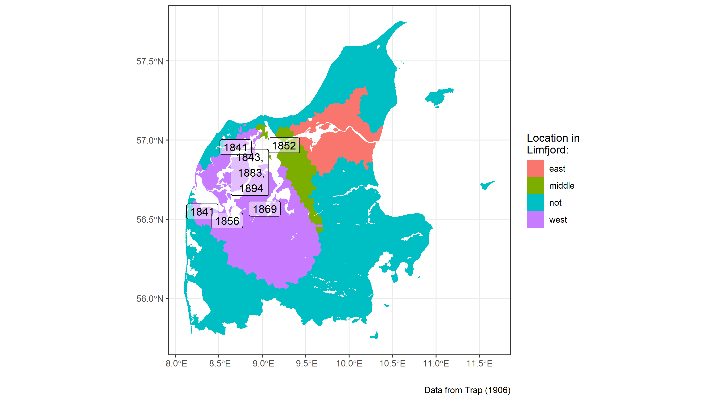

---
name: railways1
# Railways (1/2)
[Back](#instmech)

.pull-left[

]

.pull-right[


]

Source: Fertner (2013)

---
name: railways2
# Railways (2/2)
[Back](#instmech)
.pull-left[

]

.pull-right[

]

Source: Fertner (2013)

---
name: elsinor
# Elsinor


.center[
<iframe src="https://www.google.com/maps/embed?pb=!1m14!1m12!1m3!1d3743.038856836935!2d12.616720634729397!3d56.03904113734528!2m3!1f0!2f0!3f0!3m2!1i1024!2i768!4f13.1!5e1!3m2!1sda!2sdk!4v1655049802848!5m2!1sda!2sdk" width="600" height="450" style="border:0;" allowfullscreen="" loading="lazy" referrerpolicy="no-referrer-when-downgrade"></iframe>
]

[Back to STR](#str-presentation), [Back to results](#str-results)


---
name: Rob_comp
## Robustness: Comparison groups

.pull-left[
#### MA approach
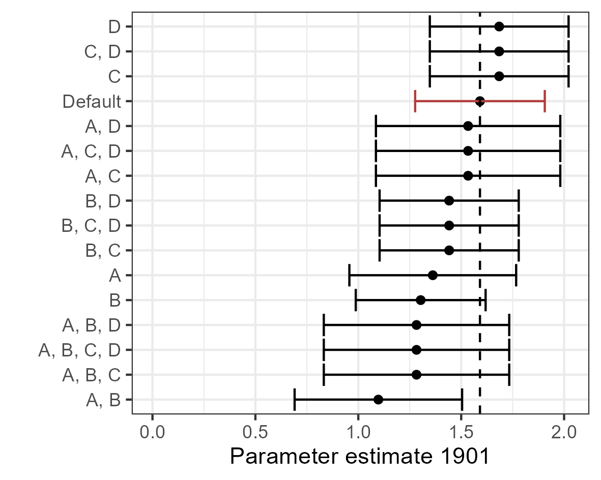
]

.pull-right[
#### Dummy approach
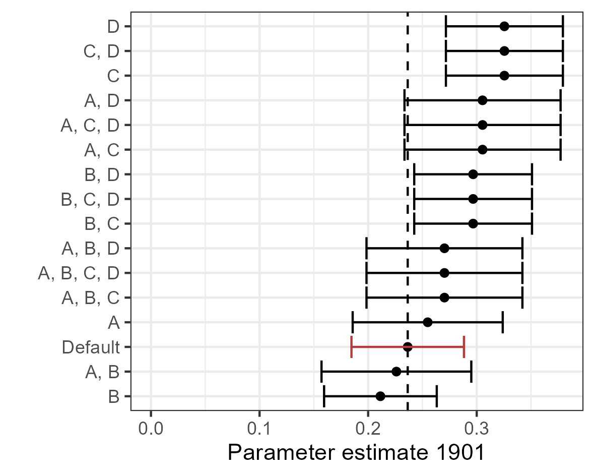
]

[Back](#pop)

.footnote[
**Definitions:** A: <5km to coast; B: Copenhagen excl.; C: Control >100 km from Limfj.; D: <5km to Market town
]


---
name: all-paramMA
## Robustness: Parameter choices

```{r echo=FALSE, out.width="60%", fig.align='center'}
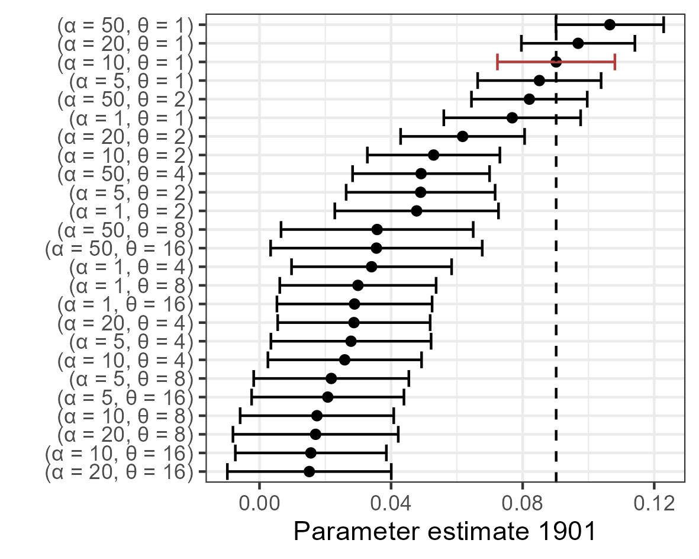
```

[Back](#pop)

---
name: pre_treat_adj
## Robustness: Pre-treat characteristics

.pull-left[
- Using the doubly robust estimator from Callaway & Sant’Anna (2021).
- Combines outcome regression with propensity score method. If either is valid, then the estimator is consistent.
- Only corrects for pre-treatment characteristics

**Columns:** (1): No adj.; (2): Adj. for age, occupation, fertility; (3): Adds log(Pop) as adj.
]

.pull-right[
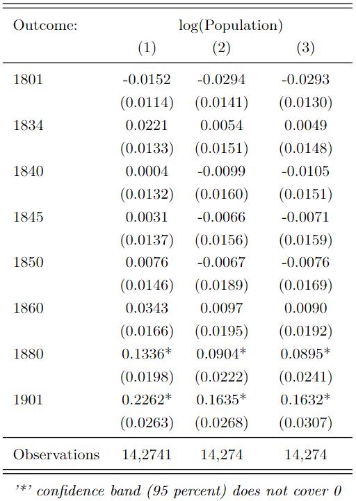
]

[Back](#pop)


---
name: fish
# Environmental impact
[Back](#mechanism1)

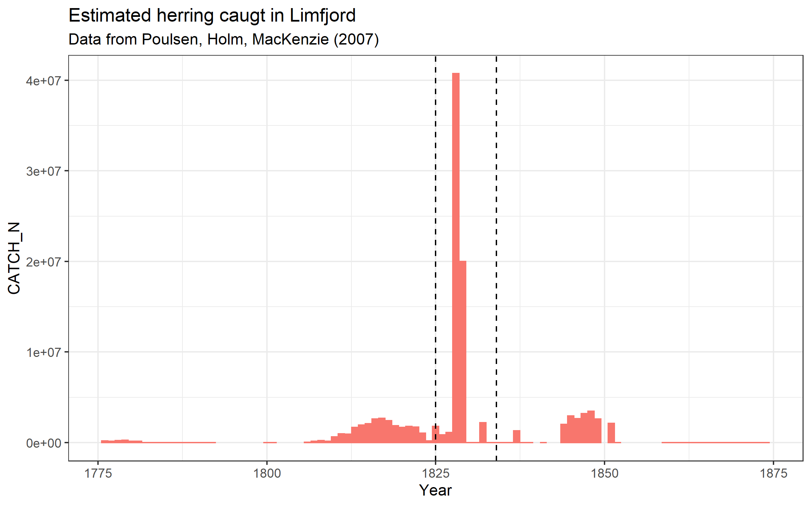

---
name: newspapers
# Newspapers

.pull-left[
- Based on all newspapers in published in the period
]

.pull-right[

]

---
name: instmech
# Mechanism: Adaptation

.pull-left[
[Back](#mechanism1)  
*Theoretical mystery desribed by Redding and Turner (2015)*

#### Historiography:
- 1840s: [New ports were constructed in all west Limfjord market towns](#new-ports)
- 1841: Independent rights for international trade
- 1852: First ever Danish steam route to England 
- 1856-1861: Construction of the Frederik VII canal at Løgstør 
- 1860-1900: [Railways](#railways1) and highways 
- 1875-1933: Groins to stabilise the channel (and coast) 
]


.pull-right[

*Milton (1884) Frederik VII canal*


*'Placat' announcing trade rights of Limfjord market towns*
]


---
name: hisco
# New occupational data
[Back](#censusdata)

.pull-left[
- Data censuses 1787-1901 contain occupational for some years (3.7 mio. observations) 
- Training data to train an automatic HISCO-label AI for all 12.4 mio. records. 
- Precision: 97.21%; Recall: 97.07% 
- Separate paper - please let me know if you have data
]

.pull-right[
#### How it is applied here
- Top 100 occupations are manually labelled as 'Fishing' or 'Manufacturing'
- Used in a mediation analysis: Can either explain away the effect of the channel?  
- Manufacturing can! 
]


---
class: center, middle
name: appendixarch
# Archaeological evidence details

.footnote[
[Back](#arch)
]

---

.pull-left[
## About the data
- Administrative database of all archaelogical sites and finds 
- Managed by ministry of culture 
- 321 generic types of findings. E.g. coins
- 1940 dated sites with coins between 750 and 1500

- Panel construction:
  + **Innovation:** Monte Carlo to estimate $P_i(Coin|t)$   
  + Probability that a coin finding was generated at a specific time

]

.pull-right[
## Data example


*Coins, wikimedia commons*
]

.footnote[
[Back](#arch)
]

---
# Estimator of coin probability
.pull-left[
- **Objective:** We want to know *how likely it is that coin was left at a particular time $t$*
- **What we have:** Observations of individual coin findings and a distribution of times $t$, which are likely for a specific coin finding in a place $i$ 

**In equation form:**
- What we have: $P_i(t|c)$: Probability of $t$ given one coin 
- What we want: $P_i(\{c\}|t)$: Probability of *any* coins in time $t$
]
--
.pull-right[
### The solution
Bayes formula and Monte Carlo
- Simple to sample from this distribution
- Sample $t$ from each coin 
- Count frequency of coin findings
$$P(\{c\}|t)=\left[1-\prod_{c=1}^{K_i} \left( 1 - P(t|c) \right)\right] P(\{c\})$$
where it is assumed that
$P(t|c)\sim \mathscr{U}(Year_{min}^c; Year_{max}^c)$ or
$P(t|c)\sim \mathscr{N}(\mu_c, \sigma_c),$
$\sigma_c=\frac{(Year_{max}^c - Year_{min}^c)}{1.96}$
]


---
### All indicators 


.footnote[
[Back](#arch)
]
---
name: matching
### Soil type matching
.pull-left[
- Soil types linked to medieval developmental trajectory (Andersen et al, 2016)
- Using common soil types to estimate treatment propensity score with XGBoost 
- Soil from GEUS
- West Limfjord matched to other parishes using greedy matching. 
]

.pull-right[
*Before*
```{r echo=FALSE, out.width="80%", fig.align='center'}
knitr::include_graphics("Figures/Propensity_before.png")
```

*After*
```{r echo=FALSE, out.width="80%", fig.align='center'}

```

]

---
name: matching_coins
#### Coin findings (matched sample)
```{r echo=FALSE, out.width="80%", fig.align='center'}

```
[Back](#arch1)
---
name: matching_buildings
#### Building findings (matched sample)
```{r echo=FALSE, out.width="80%", fig.align='center'}

```
[Back](#arch2)
---
### Safer, more convenient harbours

*Dangerous loading on the west coast*

---
# International trading rights (1/x)
.pull-left[
**Two interpretations:**
- Trading rights $\rightarrow$ Growth
- Channel $\rightarrow$ Trading rights $\rightarrow$ Growth

*Trading rights can determine population growth* (Cermeño, Enflo 2019)

- Two types of rights: 
  + Market town rights (all comercial activity had to happen in these locations) 
  + Customs rights (*toldsted*): Places where goods could be declared and taxed before it was traded on foreign markets 

]

---
# International trading rights (1/x)
.pull-left[
**Timeline**

**1657-1720:** General consumption tax in market towns and Dano-Swedish wars boosts timber/grain legal grey zone trade (*skudehandel*) between Thy and Norway.  
**1814:** Norway becomes Swedish. Illegal trade continues  
**1834-35:** Overwelmning trade with even larger ships. Coastal watch established. Thisted becomes de facto customs town.  
**1837, 1840:** Petitions to the King for formal international trading rights for all market towns  

]

.pull-right[
**1841**: Full customs rights introduced to only Limfjord Market towns 


]

.footnote[
Holm (1989); Fode (1989); Svalgaard (1977); Svalgaard (1974)
]


---
# References
Fode, Henrik (1989) Dansk Toldhistorie vol III. Toldhistorisk selskab. ISBN 87-87796-11-2

Holm, P. (1989). »... med hvad der er indfødt og norsk« Migration over Skagerrak i skudehandelstiden. Fortid Og Nutid, 1. https://tidsskrift.dk/fortidognutid/article/view/74375

Svalgaard, R. (1977). Toldvagtskibe ved Agger Kanal samt toldvagtskibet "Thyborøn." Årbog for Thy, Mors Og Vester Hanherred, 35--57.[https://www.arkivthy.dk/images/Aarbog/1977/Svalgaard](https://www.arkivthy.dk/images/Aarbog/1977/Svalgaard), 

Svalgaard, R. (1974). Toldvagtskibe ved Agger Kanal samt toldvagtskibet "Thyborøn". Thisted købstads historie 1524-1974, Historisk Årsbog for Thy, Mors Og Vester Hanherred, 151-66.

---
name: appendix2
count: false
class: center, middle, inverse
background-color: #b33d3d
# Chapter 2
# Appendix

.footnote[
[Back](#apendicies)
]

---
name: appendix3
count: false
class: center, middle, inverse
background-color: #DE7500
# Chapter 3
# Appendix

.footnote[
[Back](#apendicies)
]

---
name: appendix4
count: false
class: center, middle, inverse
background-color: #2c5c34
# Chapter 4
# Appendix

.footnote[
[Back](#apendicies)
]
